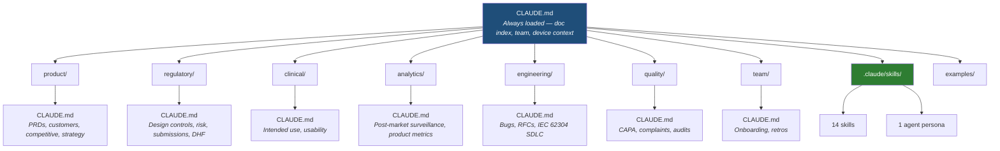

# SaMD Team OS

An AI-powered operating system for regulated medical device product teams. One repo. Every function checks in work. Any AI agent traverses it. Everyone self-serves.

SaMD Team OS gives your team a shared structure that Claude Code understands out of the box — with skills that generate regulatory artifacts (IEC 62304, ISO 14971, FDA guidance), templates that encode your QMS workflows, and a navigation layer that keeps AI context usage efficient.

## Architecture



Every folder has a `CLAUDE.md` navigation map. Claude reads the root on every session and only loads deeper context when a query targets that domain — keeping context usage under 5% for most operations.

## What's Included

### Skills (`.claude/skills/`)

| Skill | Trigger | Output |
|-------|---------|--------|
| PRD Writer | "general PRD", "product spec", "feature requirements" | Markdown PRD |
| Metrics Definition | "define metrics", "KPIs", "north star metric" | Markdown metrics framework |
| Decision Doc | "decision doc", "RFC", "ADR" | Markdown decision record |
| Status Update | "status update", "stakeholder update" | Markdown status report |
| Research Synthesis | "synthesize research", "interview findings" | Markdown research summary |
| Competitive Analysis | "competitive analysis", "market analysis" | Markdown competitive report |
| Feature Prioritization | "prioritize features", "RICE scoring" | Markdown ranked backlog |
| Roadmap Planning | "product roadmap", "quarterly plan" | Markdown roadmap |
| PRD Writer (SaMD) | "write PRD", "product requirements" | Markdown PRD with regulatory sections |
| Design Controls | "design controls", "traceability matrix", "IEC 62304" | XLSX traceability matrix |
| Risk Management | "risk management", "ISO 14971", "FMEA" | XLSX risk analysis |
| FHIR Builder | "FHIR resource", "FHIR bundle" | JSON FHIR R4 bundle |
| Change Impact | "change impact", "re-verification scope" | XLSX change impact report |
| Design Review | "design review", "PDR", "CDR", "FDR" | XLSX + markdown narrative |

### Agent Persona (`.claude/skills/agents/`)

| Agent | Use Case |
|-------|----------|
| Clinical Reviewer | Neonatal SpO2 domain expert — reviews clinical logic, alarm management, triage accuracy, and nurse handoff quality |

## Folder Structure

```
pm-os/
├── CLAUDE.md                    # Root nav — always loaded
├── README.md
├── LICENSE
│
├── .claude/skills/              # Claude Code auto-discovers these
│   ├── prd-writer/
│   ├── metrics-definition/
│   ├── decision-doc/
│   ├── status-update/
│   ├── research-synthesis/
│   ├── competitive-analysis/
│   ├── feature-prioritization/
│   ├── roadmap-planning/
│   ├── prd-writer-samd/
│   ├── design-controls/         # IEC 62304 traceability (XLSX)
│   ├── risk-management/         # ISO 14971 FMEA (XLSX)
│   ├── fhir-builder/            # FHIR R4 bundles (JSON)
│   ├── change-impact/           # Change impact analysis (XLSX)
│   ├── design-review/           # PDR/CDR/FDR gate (XLSX + MD)
│   └── agents/
│       └── clinical-reviewer/   # Neonatal SpO2 domain expert
│
├── product/                     # PRDs, strategy, competitive, customers
├── regulatory/                  # Design controls, risk, submissions, DHF
├── clinical/                    # Intended use, usability engineering
├── analytics/                   # Post-market surveillance, product metrics
├── engineering/                 # Bugs, RFCs, IEC 62304 SDLC
├── quality/                     # CAPA, complaints, audit prep
├── team/                        # Onboarding, retros
│
└── examples/                    # Pre-generated artifacts
    ├── design-controls-example.xlsx
    ├── risk-analysis-example.xlsx
    ├── fhir-bundle-example.json
    ├── samd-prd-example.md
    ├── change-impact-example.xlsx
    └── design-review-example.xlsx
```

## Getting Started

### 1. Fork this repo

```bash
git clone https://github.com/mc-barnes/pm-os.git
cd pm-os
```

### 2. Customize the root CLAUDE.md

Open `CLAUDE.md` and replace the `[placeholders]` with your team's details:
- Team roster (names, roles, Slack/GitHub handles)
- Communication channels
- Device context (classification, predicate, standards, clinical domain)

### 3. Start using skills

Skills are auto-discovered by Claude Code from `.claude/skills/`. Just say the trigger phrase:

```
> "Generate design controls for our cardiac monitor, safety class C"
> "Write a PRD for the new alarm management feature"
> "Run a risk analysis for the SpO2 threshold change"
```

### 4. Fill in templates

Each content folder has `_TEMPLATE.md` files. Copy a template, rename it, and fill in the `[brackets]`:

```bash
cp product/prds/_TEMPLATE.md product/prds/alarm-management-v2.md
```

## Example Artifacts

The `examples/` folder contains pre-generated artifacts using a neonatal pulse oximeter as the reference device:

| File | Skill Used | Contents |
|------|-----------|----------|
| `design-controls-example.xlsx` | Design Controls | Full UN → DI → DO → V&V traceability matrix |
| `risk-analysis-example.xlsx` | Risk Management | Hazard analysis + FMEA with RPN calculations |
| `fhir-bundle-example.json` | FHIR Builder | FHIR R4 bundle with Patient + Observation resources |
| `samd-prd-example.md` | PRD Writer (SaMD) | Product requirements with regulatory sections |
| `change-impact-example.xlsx` | Change Impact | Software change impact with re-verification scope |
| `design-review-example.xlsx` | Design Review | CDR gate package with GO/NO-GO recommendation |

## Context Management

SaMD Team OS uses tiered context loading to keep Claude Code efficient:

| Tier | What | When Loaded | Example |
|------|------|-------------|---------|
| **Tier 1** | Root `CLAUDE.md` | Every session | Doc index, team roster, device context |
| **Tier 2** | Folder `CLAUDE.md` | When Claude navigates to that folder | `regulatory/CLAUDE.md` loaded on a risk question |
| **Tier 3** | Templates and documents | On demand when referenced | `regulatory/risk-management/_TEMPLATE.md` |

A query about customers loads `product/CLAUDE.md` and relevant customer files — it never touches `analytics/`, `engineering/`, or `regulatory/`. This keeps context usage minimal and responses focused.

## Built with Claude Code

This repo was built entirely with [Claude Code](https://claude.com/claude-code) — from the skill authoring to the folder architecture to this README.

**Companion project**: [spo2-eval-pipeline](https://github.com/mc-barnes/spo2-eval-pipeline) — an end-to-end AI evaluation pipeline for neonatal SpO2 monitoring, also built with Claude Code.

## License

MIT — see [LICENSE](LICENSE).
