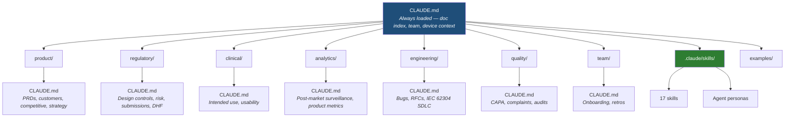

# SaMD Team OS

For teams managing software medical device on market in the US. Reviewer agents provide comprehensive design history file feedback on your document drafts, so you can author them for reviewers in minutes and not days. Your reviewers focus on substance and not cleanup.

Three reverse-engineering skills reconstruct draft regulatory artifacts from codebases that shipped before documentation caught up. Standards editions pinned (IEC 62304:2006+A1:2015, ISO 14971:2019, IEC 81001-5-1:2021). Outputs are explicit drafts — your eQMS remains the system of record.

*Ship regulated software at startup speed — whether you're building docs alongside code or catching up after launch.*

**[Getting Started in 30 Minutes →](https://mc-barnes.github.io/samd-os/getting-started.html)** — Clone to first agent review, no dependencies.

## Scope and Limitations

Skill-generated XLSX, JSON, and Markdown files are **uncontrolled drafts** — no electronic signatures, no Part 11 / Annex 11 compliance. Final approved records belong in your eQMS of record. This repo is a **working environment**, not a quality system.

## What's Included

Skills generate artifacts; agents review them.

### Reviewer Agents (`.claude/skills/agents/`)

Reviewer agents that each operate from a defined regulatory or clinical perspective. Each is a standalone `SKILL.md` — clone the folder, swap the domain knowledge, and you have a new reviewer for your vertical.

| Agent | Reviews | Standards | Verdicts |
|-------|---------|-----------|----------|
| Regulatory Reviewer | PRDs, design controls, risk docs, submissions, change requests | IEC 62304:2006+A1:2015, ISO 14971:2019, ISO 13485:2016, IEC 62366-1:2015+A1:2020, FDA guidance | ACCEPTABLE / NEEDS REVISION / NOT SUBMITTABLE |
| QA Reviewer | CAPA records, complaint files, audit findings, supplier evaluations, management reviews | ISO 13485:2016, 21 CFR 820, ISO 19011:2018 | AUDIT-READY / NEEDS REMEDIATION / NOT AUDIT-READY |
| Safety Reviewer | Risk analysis, FMEA, use-related risk, usability files, AI/ML output safety | ISO 14971:2019, IEC 62366-1:2015+A1:2020, FDA Human Factors guidance | ACCEPTABLE / NEEDS REVISION / SAFETY CONCERN |
| Cybersecurity Reviewer | Threat models, SBOMs, security architecture, pen test reports, vulnerability management | FDA Premarket Cybersecurity Guidance (June 2025), Section 524B, AAMI TIR57:2016, IEC 81001-5-1:2021 | ACCEPTABLE / NEEDS REVISION / SECURITY CONCERN |
| Clinical Reviewer | Clinical logic, alarm management, triage accuracy, handoff quality | Published neonatal literature, AAP guidelines, NRP protocols | ACCEPTABLE / NEEDS REVISION / CLINICALLY UNSAFE |

#### What the agents actually catch

**Regulatory Reviewer** — BLOCKER:
> Intended use statement does not specify patient population, clinical condition, or use setting. Per 21 CFR 807.92(a)(5), indications for use must define population, anatomy, and clinical condition. Predicate selection cannot be validated as written. → *NOT SUBMITTABLE*

**Cybersecurity Reviewer** — SECURITY FINDING:
> SBOM lists 47 components with no version numbers. Section 524B(b)(3) requires versions for vulnerability tracking. Without versions, CVE monitoring is impossible — Log4Shell demonstrated the criticality of transitive dependency tracking. → *SECURITY CONCERN*

**QA Reviewer** — OBSERVATION:
> Management review minutes record "Reviewed and acknowledged" for all agenda items but no decisions. ISO 13485:2016 §5.6.3 requires actionable output — resource allocation, improvement actions, QMS changes. Five of fourteen required §5.6.2 inputs are missing. → *NEEDS REMEDIATION*

**Safety Reviewer** — GAP:
> Risk controls jump directly to IFU warnings without documenting why inherent safety and protective measures are infeasible. ISO 14971:2019 §7.1 requires the hierarchy — inherent safety first, then protective measures, then information for safety — with departures justified. → *NEEDS REVISION*

**Clinical Reviewer** — Note:
> Alarm threshold documentation references "standard neonatal ranges" without citing the specific reference population. Pinning to published cohort data (e.g., Castillo et al. 2008 for preterm, Dawson et al. 2010 for transitional SpO2) strengthens the clinical justification during FDA review. → *ACCEPTABLE with note*

### Skills (`.claude/skills/`)

| Skill | Trigger | Output |
|-------|---------|--------|
| PRD Writer (SaMD) | "write PRD", "product requirements" | Markdown PRD with regulatory sections |
| Design Controls | "design controls", "traceability matrix", "IEC 62304" | XLSX traceability matrix |
| Risk Management | "risk management", "ISO 14971", "FMEA" | XLSX risk analysis |
| Change Impact | "change impact", "re-verification scope" | XLSX change impact report |
| Design Review | "design review", "PDR", "CDR", "FDR" | XLSX + markdown narrative |
| FHIR Builder | "FHIR resource", "FHIR bundle" | JSON FHIR R4 bundle |

#### Gap Analysis — Retrospective Compliance

Three reverse-engineering skills for teams that built first and need to document for submission. Each skill scans an existing codebase and produces two outputs: a draft artifact (XLSX) populated from code analysis, and a companion gap report (markdown) documenting exactly what's missing and who needs to fill it in. Rationale, clinical evidence, and dispositioning fields are never auto-populated — those require human accountability.

| Skill | Trigger | What It Scans | Output |
|-------|---------|---------------|--------|
| Code → SOUP Register | "SOUP register from code" | Dependency manifests (Python, JS/TS, Go, Java) | IEC 62304 §5.3.3 SOUP register XLSX + gap report |
| Code → Design Inputs | "design inputs from code" | API boundaries, config surfaces, clinical thresholds, integration points | Design input traceability matrix XLSX + gap report |
| Code → Hazard Candidates | "hazard candidates from code" | Alarm logic, threshold calculations, EHR write paths, fail-safe paths | Hazard candidate XLSX + gap report |

Every hazard candidate is marked `CANDIDATE` — these are proposals requiring human evaluation, not a completed hazard analysis. Coverage disclaimers list which code paths were analyzed and which were excluded (test/, terraform/, k8s/). Domain customization is supported via keyword files and heuristic overrides — neonatal and cardiac configs are included, and you can add your own.

For the full workflow (scope authorization, gap report cadence, auditor framing), see [Gap Analysis Guide](docs/gap-analysis-guide.md).

<details>
<summary>Plus 8 general-purpose PM skills</summary>

| Skill | Trigger | Output |
|-------|---------|--------|
| PRD Writer | "general PRD", "product spec", "feature requirements" | Markdown PRD |
| Metrics Definition | "define metrics", "KPIs", "north star metric" | Markdown metrics framework |
| Decision Doc | "decision doc", "RFC", "ADR" | Markdown decision record |
| Status Update | "status update", "stakeholder update" | Markdown status report |
| Research Synthesis | "synthesize research", "interview findings" | Markdown research summary |
| Competitive Analysis | "competitive analysis", "market analysis" | Markdown competitive report |
| Feature Prioritization | "prioritize features", "RICE scoring" | Markdown ranked backlog |
| Roadmap Planning | "product roadmap", "quarterly plan" | Markdown roadmap |

</details>

## Example Artifacts

The `examples/` folder contains pre-generated artifacts using a neonatal pulse oximeter as the reference device. The neonatal SpO2 device used throughout these examples is built and documented in [spo2-eval-pipeline](https://github.com/mc-barnes/spo2-eval-pipeline).

| File | Skill | Contents |
|------|-------|----------|
| `design-controls-example.xlsx` | Design Controls | Full UN → DI → DO → V&V traceability matrix |
| `risk-analysis-example.xlsx` | Risk Management | Hazard analysis (per ISO 14971:2019) plus separate process FMEA with RPN |
| `fhir-bundle-example.json` | FHIR Builder | FHIR R4 bundle with Patient + Observation resources |
| `samd-prd-example.md` | PRD Writer (SaMD) | Product requirements with regulatory sections |
| `change-impact-example.xlsx` | Change Impact | Software change impact with re-verification scope |
| `design-review-example.xlsx` | Design Review | CDR gate package with GO/NO-GO recommendation |

The `examples/test-fixtures/` folder also includes 12 gap analysis fixtures (4 per skill) with deliberately varied scenarios — GPL license detection, multi-language repos, PRD-to-code mismatches, cardiac domain overrides, and graceful empty-repo handling. Each fixture has a README documenting expected output.

**What makes a SaMD PRD different?** The [example PRD](examples/samd-prd-example.md) includes sections you won't find in a generic product spec: intended use / indications for use (§1), regulatory context with device classification and IEC 62304 software class (§3), clinical requirements with validation plan and performance targets (§4), design inputs traceable by requirement ID (§5), EHR integration with HL7/FHIR specs (§7), and a preliminary risk analysis per ISO 14971 (§8).

## Architecture



Every folder has a `CLAUDE.md` navigation map. Claude reads the root on every session and only loads deeper context when a query targets that domain — keeping context usage under 5% for most operations.

Multi-agent reviews run all relevant reviewers in parallel via a configurable orchestration skill — see [DEC-001](team/decisions/dec-001-review-panel-orchestration.md) for the design.

### Context Management

| Tier | What | When Loaded | Example |
|------|------|-------------|---------|
| **Tier 1** | Root `CLAUDE.md` | Every session | Doc index, team roster, device context |
| **Tier 2** | Folder `CLAUDE.md` | When Claude navigates to that folder | `regulatory/CLAUDE.md` loaded on a risk question |
| **Tier 3** | Templates and documents | On demand when referenced | `regulatory/risk-management/_TEMPLATE.md` |

A query about customers loads `product/CLAUDE.md` and relevant customer files — it never touches `analytics/`, `engineering/`, or `regulatory/`. This keeps context usage minimal and responses focused.

## Project Status

Ready for small-team pilots. Not yet validated for enterprise rollout — and that's intentional. Validation status: 20/20 fixture format pass (dry-run); live agent evaluation pending — see [eval results](docs/eval-results-2026-04-30.md). Start with one PM, one product, one sprint. Evaluate agent findings against your RA/QA team's own assessments. If the findings are useful, expand.

For adoption planning, see [Adoption Guide](docs/adoption-guide.md). For validation details and QMS integration, see [Responsible Use](docs/responsible-use.md). For audit preparation, see [Auditor Briefing](docs/auditor-briefing.md). For retrospective compliance workflows, see [Gap Analysis Guide](docs/gap-analysis-guide.md).

## Cost

Agent reviews use the Claude API. Costs depend on artifact length and number of agents invoked.

| Operation | Estimated Cost |
|-----------|---------------|
| Single agent review | $0.05 – $0.15 |
| Full review panel (all agents) | $0.25 – $0.75 |
| Eval run (20 fixtures) | ~$2.00 |
| Weekly team usage (5 artifacts, panel review) | $5 – $15/month |

Estimates based on current Claude API pricing as of April 2026. For a team of 3-5, expect $10-30/month in typical usage. Re-eval runs (~$2 each) are triggered by SKILL.md edits, model version changes, or standards updates — typically several runs per quarter.

## Getting Started

**Try it now:** Clone the repo, open Claude Code, and say *"Run a risk analysis for a neonatal SpO2 threshold change."* The Risk Management skill generates a hazard analysis worksheet with hazard → sequence of events → harm columns, severity/probability scoring, and risk control traceability — ready to drop into your eQMS as a draft.

### 1. Fork this repo

```bash
git clone https://github.com/mc-barnes/samd-os.git
cd samd-os
```

### 2. Customize the root CLAUDE.md

Open `CLAUDE.md` and replace the `[placeholders]` with your team's details:
- Team roster (names, roles, Slack/GitHub handles)
- Communication channels
- Device context (classification, predicate, standards, clinical domain)

### 3. Start using skills

Skills are auto-discovered by Claude Code from `.claude/skills/`. Just say the trigger phrase:

```
> "Generate design controls for our cardiac monitor, safety class C"
> "Write a PRD for the new alarm management feature"
> "Run a risk analysis for the SpO2 threshold change"
> "Generate a SOUP register from my codebase at ../my-device"
> "Find hazard candidates in the alarm logic module"
```

### 4. Fill in templates

Each content folder has `_TEMPLATE.md` files with YAML frontmatter pre-configured (`type`, `status: draft`, `owner`). Copy a template, rename it, and fill in the `[brackets]`:

```bash
cp product/prds/_TEMPLATE.md product/prds/alarm-management-v2.md
```

### 5. Check document status

Run the status generator to see what's draft, in-review, approved, or stale:

```bash
./scripts/status.sh    # generates STATUS.md from frontmatter
```

`status.sh` scans all markdown files for YAML frontmatter (`type`, `status`, `owner`, `last-reviewed`), groups them by lifecycle stage, and flags documents older than 14 days as stale. Use the output for weekly team syncs — it shows at a glance which artifacts are waiting for review, which are approved, and which need attention.

<details>
<summary>Folder Structure</summary>

```
samd-os/
├── CLAUDE.md                    # Root nav — always loaded
├── README.md
├── CONTRIBUTING.md
├── LICENSE
│
├── .claude/skills/              # Claude Code auto-discovers these
│   ├── prd-writer/
│   ├── metrics-definition/
│   ├── decision-doc/
│   ├── status-update/
│   ├── research-synthesis/
│   ├── competitive-analysis/
│   ├── feature-prioritization/
│   ├── roadmap-planning/
│   ├── prd-writer-samd/
│   ├── design-controls/         # IEC 62304 traceability (XLSX)
│   ├── risk-management/         # ISO 14971 FMEA (XLSX)
│   ├── fhir-builder/            # FHIR R4 bundles (JSON)
│   ├── change-impact/           # Change impact analysis (XLSX)
│   ├── design-review/           # PDR/CDR/FDR gate (XLSX + MD)
│   ├── code-to-soup-register/   # Reverse-engineer SOUP from deps
│   ├── code-to-design-inputs/   # Reverse-engineer DIs from code
│   │   └── references/          # Domain keywords (neonatal, cardiac)
│   ├── code-to-hazard-candidates/ # Reverse-engineer hazards from code
│   │   └── references/          # Domain heuristic overrides
│   └── agents/
│       ├── regulatory-reviewer/ # FDA SaMD submission reviewer
│       ├── qa-reviewer/         # ISO 13485 QMS auditor
│       ├── safety-reviewer/     # Patient safety & human factors
│       ├── cybersecurity-reviewer/ # Medical device cybersecurity & 524B
│       └── clinical-reviewer/   # Domain expert (example: neonatal SpO2)
│
├── product/                     # PRDs, strategy, competitive, customers
├── regulatory/                  # Design controls, risk, submissions, DHF, gap analysis
├── clinical/                    # Intended use, usability, clinical evaluation
├── analytics/                   # Post-market surveillance, product metrics
├── engineering/                 # Bugs, RFCs, IEC 62304 SDLC
├── quality/                     # CAPA, complaints, audit prep
├── team/                        # Onboarding, retros, decisions
├── scripts/                     # status.sh, eval-agents.sh
├── docs/                        # Adoption guide, responsible use, auditor briefing
│
└── examples/                    # Pre-generated artifacts
    ├── design-controls-example.xlsx
    ├── risk-analysis-example.xlsx
    ├── fhir-bundle-example.json
    ├── samd-prd-example.md
    ├── change-impact-example.xlsx
    ├── design-review-example.xlsx
    └── test-fixtures/              # 20 agent review fixtures + 12 gap analysis fixtures
```

</details>

## Built with Claude Code

This repo was built entirely with [Claude Code](https://claude.com/claude-code) — from the skill authoring to the folder architecture to this README.

**Companion project**: [spo2-eval-pipeline](https://github.com/mc-barnes/spo2-eval-pipeline) — an end-to-end AI evaluation pipeline for neonatal SpO2 monitoring, also built with Claude Code.

## License

MIT — see [LICENSE](LICENSE).
